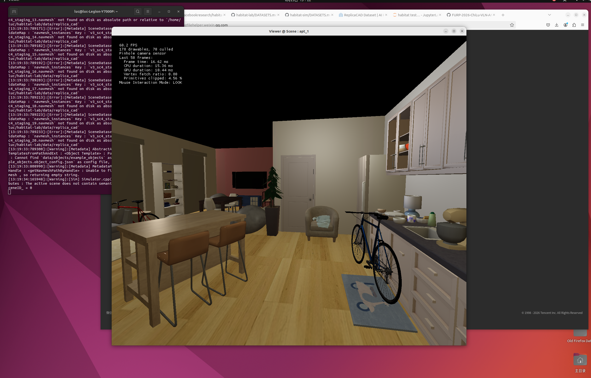

# （26.6.17）第一次成功联机issac & ROS2

- docker 安装完成；发现nvidia docker已经废弃，问群里也没有建设性的结论
- szr建议不要先安装数据集，而是应该先建立一个简单的环境，检验小车是否能跑动
  - 开始学习szr的github
  - 发现其实如果我只是想重现“R2R / Matterport path for classic VLN reproduction”的baseline的话，并不需要弄出一个能在虚拟环境中运动的机器人；发送加好友申请打算询问szr
  - 还是打算先学习zsr，开始下载ROS2
- ROS2下载完成，确认与issacsim通信无误，开始安装小车
- 成功让小车能够接受键盘的指令并且在issacsim中运动

# （26.6.18）第二次成功联机issac & ROS2

- 发现“重新运行issacsim时与ros的通信失败”，尝试解决问题
  - 试图重新运行issacsim并加载ros2，失败
  - 学习理解ros2的环境为什么每次都要重新添加
  - 再次尝试，依然失败
  - 发现是conda配置的python环境污染了ros2
  - 开始尝试在关闭conda的情况下重启issacsim
  - 在gpt“issac sim启动问题”这一章节的指导下完成任务
- 申请的matterport3d数据拿到了

# （26.6.19）稳定issac & ROS2 连接；确立工程大纲

- 试图理解为什么最后issacsim ros通信成功，失败的原因又是什么
  - 实在无法彻底理解（抽象的概念太多），因此只给出了解决方案：
    - （26.6.19）为什么issac连不上ROS2？
- 写启动脚本（涵盖各种环境问题），试图启动issacsim，显示：
  - failed to query CUDA device count.
- 研究后发现问题：
  - conda 在 Python启动阶段污染了 CUDA context，导致 PyTorch 直接认为 GPU 不存在
  - conda 的“启动污染”已经发生在 shell 初始化阶段
  - conda 在 shell 启动阶段“强行接管了整个 Python + CUDA 环境”
- 重写了启动脚本，解决问题。见为什么连不上ROS2？
- 设定下一目标：照zsr的md，配置 Habitat-Sim 仿真环境并加载预训练权重。
  - 学习habitat sim是什么
    - 发现是一个专门用来做AI导航训练的3d模拟器，恰好符合我做VLN导航训练的目标
    - 理解了之所以要用habitatsim是为了在一个“标准机器人仿真环境”里验证 VLN / VLA 模型
  - 发现zsr的node3和habitat sim没关系
  - 怀疑为什么要装habitat，既然我已经装好issac且保证其与ros2的通信
- 重新设定目标：研究如何在issacsim+ros2通信良好的情况下继续做VLN pipeline
  - 目前做到的：Action Interface 已完成（agent可以接受我的指令并移动）
  - 还缺乏的：（参见gpt“VLN实验实现步骤”）
    - 视觉输入 (camera)
    - 环境搭建
    - 语言指令输入
    - observation节点（将杂乱信息翻译成multimodal latent representation，详见学习笔记）
    - 最简单VLN policy（先不用大语言模型 & if-else policy）
- 创建KEEP TRACK：确立总目标和目前需要实现的简化目标。
  - 用AI检验计划成熟度
    - 建议用habitat sim而不是issac sim搭建环境，因为issac过度关注物理仿真复杂度，可能不会关注VLN本身
    - 建议用multimodal latent representation而不是state representation来描述我做“动作+图像+语言”对齐操作的表述，因为这两个词不是一个概念。
  - 检验后给出目前的简化目标。见KEEP TRACK
- 开始尝试第一步：Action：让小车在habitat sim中接受速度命令并移动
  - 研究habitatsim的安装注意事项（之前被issac sim坑惨了）
    - Habitat 不怕 Conda，因为它本来就是设计给 Conda 环境使用的。
    - 但是一个项目用一个环境运行是很重要的，全部软件都在base上安装会导致环境污染。
    - 因此，需要开一个新的环境安装habitat。

# （26.6.20）研究habitat的安装 & 再次检验issac启动脚本是否有效

- 研究habitat的安装注意事项，顺便继续尝试搞明白conda环境的影响，以及它为什么影响ros2和issacsim环境。
  - ros2和issacsim应当在独立于conda的环境中运行。写一个自定义启动脚本和取消conda自动激活机制都是好的策略。
  - 但是，habitat本就优先支持conda环境安装。
- 再次检验issac启动脚本是否有效。
  - 依旧出错！显示：failed to query CUDA device count.
    - Cuda failure ../../../source/plugins/carb.cudainterop/p2pBandwidthLatencyTest/p2pBandwidthLatencyTest.cu:681: 'unknown error'
    - 2026-06-20T04:33:34Z [738ms] [Error] [carb.cudainterop.plugin] CUDA error 999: cudaErrorUnknown - unknown error
    - 2026-06-20T04:33:34Z [738ms] [Error] [carb.cudainterop.plugin] Failed to query CUDA device count.
    - 2026-06-20T04:33:34Z [738ms] [Warning] [omni.gpu_foundation_factory.plugin] RT-capable GPU not found, switching to compatibility mode
  - 目前面对的现状是：我认为issac启动失败是因为conda环境的python与issac的默认python冲突，因此写了自定义的启动脚本取消了conda自动开启机制，甚至连所有shell中的conda自动开启机制都取消了（现在打开的terminal已经不会显示（base））。但是依旧报错。
  - 问题在于，有的时候启动脚本能够成功，但是如果隔一天再打开几乎总是会失败。我需要找到根本原因。
  - GPT的回答：不是 CUDA 坏了，而是环境变量（尤其 conda / LD_LIBRARY_PATH）让 Isaac Sim 误加载了错误的 CUDA / GPU库。
  - 我检查了之前写的启动脚本，发现它似乎是空的，但是他又可以启动issacsim，虽然失败了。现在试图搞清楚他是不是空的，成分是什么，作用是什么，为什么失败了。

# （26.6.21）锁定打开issacim & ROS2的办法；在habitat上燃尽

- 延续昨天，继续检验issacsim启动脚本的问题。
  - 今天再次尝试，依然failed to query CUDA device count.
  - 试图搞清命令脚本是不是空的，成分是什么，作用是什么，为什么失败了。
    - 发现命令脚本有内容。
    - 检查发现在运行启动脚本之前issacsim的python就找不到CUDA，这意味着失败和conda可能没关系。
    - AI说，GPU driver / CUDA runtime 在异常中断后进入错误的上下文状态，导致设备枚举失败，只能通过重启清空驱动状态恢复：重建 GPU driver + CUDA runtime 的干净初始状态。
    - 发现重启后成功。
    - 作出推断：issacsim在刚刚启动的系统上只能运行一次。如果直接关闭终端后再次启动，失败的可能性就很高。因此重启+启动脚本是可以稳妥打开issacsim的办法
- 开始安装habitat。
  - 理解habitat sim和lab的不同以及安装方式。
  - 安装完毕habitat sim & lab
  - testing
    - 第一次报错：没有下载git-lfs
    - 第二次报错：世界（dataset + navmesh）建设不完整
  - 在经历了无穷无尽的报错后，我删除了（至少尝试删除了，但不确定环境是否被污染）所有conda中的habitat环境。我再次尝试下载，但这次连下载也无法成功了。一直有部分内容似乎因为网络问题始终无法正常下载。
  - 我决定暂时放弃，到学校（换个网络环境后）重新尝试。

# （26.6.22）成功下载habitat并跑通测试；研究可视化，学习habitat

- 延续昨天，尝试下载habitat lab。
  - 确认删除所有内容（自认为）后，按照github教程重新尝试下载。
  - 完成了所有下载，包括：
    - conda env (python=3.9, cmake=3.14.0)
    - habitat sim with bulletin physics
    - habitat lab stable version
    - habitat-baselines
  - 可以确认软件是安装成功了（上次应该也成功了），但是我误解了教程中testing的部分，在没有下载数据集的情况下一直尝试运行，导致报错。
  - 开始尝试运行教程让我下载的测试数据集。
    - 成功跑通（non-interactive testing）
      - 具体流程：
        - 用 Habitat-Lab 读取 PointNav 测试任务，
        - 用 Habitat-Sim 加载测试场景 skokloster-castle.glb，
        - 让一个默认 agent 跑 10 个点导航 episode，
        - 最后输出导航评估指标。
      - 输出结果
        - distance_to_goal: 12.975
        - success: 0.000
        - spl: 0.000
        - distance_to_goal_reward: -0.000
          - 成功率为0是因为采用的默认agent没有导航能力。毕竟目标只是测试环境和nav.set
    - 尝试让测试可视化
      - 并不顺利。GPT给了我几个代码，但它似乎不知道怎么跑通。
    - 尝试interactive testing
      - 并未下载 'data/datasets/replica_cad/rearrange/v2/train/rearrange_easy.json.gz' or 'data/replica_cad/'
  - 阅读github，学习habitat的功能和使用方式
    - 学习habitat examples：.py脚本
      - 脚本能开启habitat的不同功能
    - 在habitat文件夹里翻来翻去，阅读readme和tutorial
    - 打开example.py，学习其python code
    - 确认example.py不可能打开，因为其需要的dataset在软件包中不存在，在github也找不到。这也并不关键。
  - 尝试启用ReplicaCAD页面的display system visualization：
    - https://aihabitat.org/datasets/replica_cad/

# （26.6.23）Habitat 可视化成功 & Habitat2_quickstart.py学习

- 继续研究如何打开ReplicaCAD数据集中的interactive viewer
  - 使用C++ viewer，启动 ReplicaCAD Interactive scene。
  - 运行方式：
    - conda activate habitat
    - habitat-viewer --enable-physics --dataset ~/habitat-lab/data/replica_cad/replicaCAD.scene_dataset_config.json -- apt_1
  - 测试证明：
    - Habitat-Sim 安装正确 ✓
    - ReplicaCAD 下载正确 ✓
    - 场景资源完整 ✓
    - OpenGL 渲染正常 ✓
    - Physics 正常 ✓
    - Viewer 正常 ✓
  - 截图证明：
  - 
  - 使用C++ viewer，启动ReplicaCAD Baked Lighting scene。
    - habitat-viewer --enable-physics --dataset ~/habitat-lab/data/replica_cad_baked_lighting/replicaCAD_baked.scene_dataset_config.json -- sc1_staging_00
- 学习habitat内置的Habitat2_quickstart.py
  - 将tutorial.py转化为ipynb放进pycharm，开始边运行边学习
  - Quickstart：依然为了数据包位置不对的问题纠缠不清。
    - 报错：依然在为了ValueError: Requested RearrangeDataset config paths 'data/datasets/replica_cad/rearrange/v2/train/rearrange_easy.json.gz' or 'data/replica_cad/' are not downloaded locally.
    - 已经按照教程的提示下载了对应的数据集，但是可能因为路径不匹配（我的电脑并没有将文件放在它预期的位置）而出问题
    - 在pycharm上开启了qwen code
    - 在terminal安装了codex
    - 决定放弃这一部分。毕竟本来就是测试，但是也许因为版本不匹配导致失败，并不是关键问题。
  - Defining New Task：遇到相似的问题
  - 运行到后面发现依然出现文件path不一致，难以读取的情况。决定专注解决。
    - 问题的具体表现：代码想要调用"rearrange.sensor"这个属性，可是我的habitat lab没有这个属性，只有"rearrange_suite.sensor"。
    - 这意味着，我的habitat lab和habitat sim的版本看似一致，其实有差别。
    - 研究发现，确实如此。这导致虽然属性里装的内容一致，但是名字改过了，就无法顺利调用。
    - 更新了（其实是往旧版本改）habitat lab的版本，再次尝试：
    - 成功运行并得到录制视频！

# （26.6.25）方向转换：对GigaBrain基础知识的初步研究

在博士提示后转换方向，开始研究GigaBrain-0和ETP-Nav。先研究GigaBrain。

- 研读GigaBrain论文
  - 可以理解基础的思想：
    - 模型的核心价值在于世界生成数据极大扩大了训练数据范围，且采用RGBD输入建模和具身的链式推理（CoT）监督方法。
  - 但是完全无法理解其原理。严重缺乏基础知识。
  - 决定先对付工程问题：将这个东西跑起来，解决某些问题。核心价值大概理解就行，不必追根求底。
- 先一定程度搞明白GigaBrain，再安装它
  - GigaBrain-0依赖于以下三个框架：
    - GigaTrain：一个高效且可扩展的人工智能模型训练框架。
    - GigaDatasets：一个统一、轻量级的数据管理、评估和可视化框架。
    - GigaModels：一个综合性的多模态、生成式和感知模型存储库。
  - 先搞明白这三个框架具体做什么。
    - GigaModels：能让我高效调用各种模型，进行训练。
    - GigaDatasets：能将多模态数据（图像 + 视频 + 3D点云 + 机器人数据）统一成固定格式，无需使用者自己转换，极大方便数据管理。
    - GigaTrain：让你更轻松训练大模型的工程基础设施，无需解决各种复杂问题（我看不懂这些问题）：
      - 多GPU / 多机器分布式训练（DDP / DeepSpeed / FSDP）
      - 混合精度（FP16 / BF16）
      - 梯度累积、梯度检查点（省显存）
      - checkpoint 保存与断点恢复
      - 日志记录（loss、metrics）
      - EMA、优化器、学习率调度
      - 各种训练代码的拼接和管理
      - 

# （26.6.26）install gigabrain &  read the thesis about ETPNav

- 在新的 Conda 环境中安装 gigabrain-0。
    - 目前不知道下一步该做什么：提示中提到需要先将数据转换为 LeRobot 格式，但我不清楚应该在哪里进行转换，也不知道需要准备哪些数据。
学习 ETPNav（课题组推荐的另一个项目/网站）。
- 阅读其论文（尚未完成）。

# (26.6.30)阅读ETPNav; 研究gigabrain，下载环境依赖和模型预训练参数

- 继续阅读ETPNav论文
- 重新拾起gigabrain，研究
    - gigabrain就是一个用各种数据（许多人工合成数据）预训练完毕的模型（大脑），可以直接接入机器人中。
    - 但是具身智能和或联网智能不同，即便数据量大了（gigabrain），由于训练只能在一定数量的机器人上进行，而不同的机器人各方面（零件，摄像头，关节）注定有差距，因此即便接上大脑，也依然需要用该机器人的数据进行训练。
    - github的作者默认你是一个机器人研究者，有自己的机器人和训练数据，要求将自己的数据转为Lerobot格式后训练gigabrain，再部署到机器人上。
    - 我并没有机器人，也没有相应的数据。调查后我决定，先下载环境依赖（已下载），模型预训练参数（也就是已经训练好的模型大脑，和环境依赖拼起来就是完整的模型）和Lerobot上的公开机器人数据，尝试测试gigabrain的能力。
- 下载模型预训练参数（checkpoint）
    - 下载完成
    - 检查路径，确认环境依赖+训练参数全部下载完毕！
